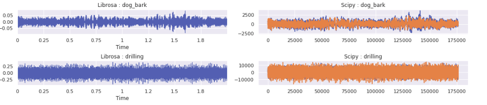

# Urban 8K Audio Classification with Pytorch

## Dataset Description
This dataset contains 8732 labeled sound excerpts (<=4s) of urban sounds from 10 classes: air_conditioner, car_horn, children_playing, dog_bark, drilling, enginge_idling, gun_shot, jackhammer, siren, and street_music. The classes are drawn from the urban sound taxonomy. For a detailed description of the dataset and how it was compiled please refer to our paper.
All excerpts are taken from field recordings uploaded to www.freesound.org. The files are pre-sorted into ten folds (folders named fold1-fold10) to help in the reproduction of and comparison with the automatic classification results reported in the article above.

In addition to the sound excerpts, a CSV file containing metadata about each excerpt is also provided.

**8732 audio files of urban sounds (see description above) in WAV format. The sampling rate, bit depth, and number of channels are the same as those of the original file uploaded to Freesound (and hence may vary from file to file).**

## Dataset Description
The Dataset contains 10 classes, we will do classification task on the audio file obtained.
```
A numeric identifier of the sound class:
0 = air_conditioner
1 = car_horn
2 = children_playing
3 = dog_bark
4 = drilling
5 = engine_idling
6 = gun_shot
7 = jackhammer
8 = siren
9 = street_music
```

Image below represents the distribution the sounds:


## How to get the Urban8K Dataset?
Just go to [Urban8K Website](https://urbansounddataset.weebly.com/urbansound8k.html) and fill a simple form to download the dataset. Since the dataset is > 5GB in compressed form itself, it's better to copy the download link and directly !wget it to the colab and move to the drive for further use.


> The notebook themselves will walk you through the projects easily. They are standalone as in functioning.

The workflow of project:
* **Data Collection & Cleaning** : The data is available for download via [website](www.freesound.org) or you can use the command mentioned inside notebooks. The key takeaways are that the dataset is > 5GB and it's better to store it on Google Drive if you are using google colab.

* **Feature Extraction** : Audio has multiple features such as volume, pitch, energey, bitrate etc. We will using Mel Frequency Cepstrum Coefficients for this very task. Each and every audio has different number of MFCC attached to it.

### Visualization of Different Audio @22.05Khz using Librosa


### Visualization of Different Audio @22.05Khz using Librosa & Scipy


### MFCC Features for n=30 and 40 for respective sounds


* **Model & Training** : The models are hosted in github gists. Each notebook has multiple models for comparitive accuracy and loss tracking. CNN Notebook has one additional feature of dynamic model generation, where user can directly mention the hyperparameters and the model will be create on it's own without writing a single line of code for it.

* **Validation** : ANN, CNN and RNN all were tested apparently CNN perform best. Apparently after reading it seems that MFCC features are not time-related they are independent segments and hence RNN perform poorly.

## Results :

### Linear Models


### CNN Models


